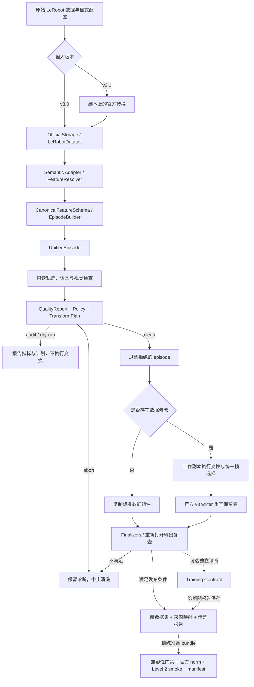

# lerobot-cleaner · LeRobot 数据质量与 LingBot-VLA 训练适配

本项目基于 [Escapist-coder/lerobot_cleaner](https://github.com/Escapist-coder/lerobot_cleaner) 扩展。上游提供面向 GR00T-format LeRobot v2.1 的配置化清洗流程；本分支在保留旧流程的基础上，增加 LeRobot v3.0 数据访问、多源特征语义映射、轨迹与多模态质量审计、显式清洗计划，以及 LingBot-VLA 训练兼容性检查。

项目关注三个相互独立的问题：**数据能否被正确解释、清洗修改是否有依据且保持对齐、清洗结果能否满足指定训练配置。** 输出包括新的数据集、输入/输出质量报告、修改计划和来源映射，便于审查每次清洗的原因与影响。

> **状态与适用范围**：下文架构描述对应当前代码实现。仓库包含单元测试、合成数据测试及历史验证记录，但不能据此宣称当前版本已在真实官方加载器、完整数据清洗和 LingBot 训练中全部验证。当前文档更新未运行项目或测试；具体验证边界见文末。

## 阅读导航

- [相对上游的修改](#相对上游的修改)
- [当前项目架构](#当前项目架构)
- [数据流与处理阶段](#数据流与处理阶段)
- [清洗规则与决策机制](#清洗规则与决策机制)
- [安装与使用](#安装与使用)
- [输出与可追溯性](#输出与可追溯性)
- [LingBot-VLA 训练对接](#lingbot-vla-训练对接)
- [验证范围与后续评估](#验证范围与后续评估)
- [旧版 GR00T v2.1 使用说明](#旧版-gr00t-v21-使用说明)

## 相对上游的修改

上游已有 R1–R8 规则、YAML 配置、交互式向导、清洗报告及 GR00T/openpi 双格式统计。这些能力在本分支中被保留；本分支的新增工作集中在格式扩展、职责拆分、质量分析及模型训练接口。

| 方向 | 上游基础与新增需求 | 本分支的实现 | 主要代码位置 |
|---|---|---|---|
| 数据格式与访问 | 上游依赖 v2.1 逐集文件和 GR00T `modality.json`；v3 使用共享分片和视频区间 | 统一入口通过官方 LeRobot 0.4.2 访问 v3；v2.1 先在副本上官方转换；保留 legacy 入口 | `storage/`、`v30/pipeline.py`、`v21/` |
| 特征语义 | 同一向量在不同机器人中可能具有不同切片、单位和动作含义 | 增加 LeRobot、Generic、LingBot、GR00T 适配器，以及统一 Schema 和特征解析器 | `adapters/` |
| 规则组织 | 需要分别追踪检测结果、拒绝原因和实际数值修改 | 将检查、策略、变换和数据集收尾分离，生成 `QualityReport` 与 `TransformPlan` | `core/quality/`、`core/plans.py`、`transforms/`、`finalizers/` |
| 轨迹质量 | 有限值和范围检查不足以描述运动异常 | 增加一至三阶时间导数、导数 Z-score、分组检查、state/action 联合静止度及阈值校准 | `core/quality/`、`v30/quality_groups.py`、`v30/calibration.py` |
| 多模态完整性 | 需要同时检查数值、任务文本、图像及视频关联 | 统一 image/video 视觉语义，保留语言来源与 episode/sample 关联，区分元数据检查、采样解码和全量解码 | `storage/`、`core/quality/integrity/`、`v30/visual.py` |
| 写出与审计 | 删帧、删集和 ROI 修改可能破坏视频对齐或元数据 | 统一帧选择，官方 writer 重建输出，复查后发布；记录原始帧选择与 episode 对照 | `transforms/trajectory/`、`storage/writer.py`、`finalizers/v3.py` |
| 训练适配 | LeRobot 文件合法不代表 LingBot 的 horizon、维度、相机和文本兼容 | 增加静态映射校验、Training Contract、分级 smoke 和训练准备 bundle | `training/`、`v30/lingbot/` |
| 数据集配置 | DROID/Franka、LIBERO 和 R1Pro 的布局不能混用 | 分离清洗配置、数据集 profile、本体 spec 和训练配置，提供专属入口 | `configs/`、`scripts/` |

这些修改提供了更明确的分析和干预接口；是否改善下游学习效果，需要通过保留率、分布变化、训练消融与任务评估另行证明。

表中主要代码路径相对于 `lerobot_cleaner/` 主包；`configs/`、`scripts/` 位于仓库根目录。

## 当前项目架构

### 目录与职责

```text
lerobot_cleaner/
├── cli.py                      # 命令路由：统一入口、legacy、训练检查及导出
├── storage/                    # 官方加载、版本准备、图像/视频访问和 v3 writer
├── adapters/                   # 数据集语义适配、切片/拼接、Schema、episode 组装
├── core/
│   ├── trajectory.py           # 只读 TrajectoryView 与共享检查结果
│   ├── physical.py             # 单位、表示、控制类型与物理差分语义
│   ├── plans.py                # QualityReport / EpisodeDecision / TransformPlan
│   └── quality/                # 数值、时间、运动、语言、视觉等只读检查
├── transforms/                 # 在工作副本上执行帧过滤、数值处理、夹爪及 ROI 计划
├── finalizers/                 # 官方写出收尾及输出结构复核
├── training/
│   ├── contracts/              # 指定 LingBot 版本的训练接口约定
│   ├── compatibility/          # chunk、padding、维度、语言和相机诊断
│   └── smoke/                  # 实际 loader、preprocessing/collator 与 forward 检查
├── v30/                        # 统一清洗编排、规则策略、审查报告、校准
│   └── lingbot/                # 格式导出、映射生成、归一化启动与 bundle
└── v21/                        # 保留的 GR00T v2.1 专用流程及兼容接口

configs/                        # cleaning / mappings / profiles / embodiments / robot_configs / vla
scripts/                        # DROID、LIBERO、LingBot 等使用入口
presets/                        # legacy GR00T v2.1 预设
examples/                       # 配置示例
tests/                          # 共享层、训练集成、v21 和 v30 测试
docs/                           # 各模块及数据集的专题说明
```

### 四个关键职责边界

1. **Storage 负责“数据在哪里、怎样读取”。** 统一入口只接受 `reader_backend: lerobot`。episode 边界、任务表、分片位置和视频区间来自官方数据访问层；加载失败时不自动退回另一套本地解析器。
2. **Adapter / Schema 负责“这些字段代表什么”。** 显式解释 state/action 切片、拼接顺序、相机和语言关联。默认 LeRobot 适配器使用指定的完整向量；复杂布局使用 `mapping_config`，不凭机器人名称猜测语义。
3. **Quality / Policy / Transforms 分别负责“发现问题、决定处理方式、实施修改”。** 数值轨迹算法读取不可写的 `TrajectoryView`，语言与视觉检查使用各自的数据接口；policy 将结果解释为记录、告警、拒绝 episode 或中止；只有显式计划进入变换器。
4. **Training 负责“目标模型如何消费数据”。** horizon、padding、joint mask、tokenizer 和 normalization 的约束独立于一般数据质量。清洗代码不通过删帧去掩盖训练配置错误。

`CanonicalFeatureSchema` 保存命名特征、来源列、切片、拼接顺序及可选物理语义。`EpisodeBuilder` 将官方已对齐的数据组装为 `UnifiedEpisode`；供独立数值流使用的 `build_streams` 另提供显式对齐、缺失值和 padding 策略，现有清洗入口不隐式重采样。

共享质量核心由 v2.1 与 v3 路径复用；版本层保留各自的编排和格式约束。`from lerobot_cleaner import clean` 目前仍调用旧 v2.1 pipeline，不能视作新版统一入口。

## 数据流与处理阶段



| 阶段 | 输入与处理 | 可审查的结果 |
|---|---|---|
| 1. 准备 | 校验配置；读取 v3，或在 `converted_root` 中转换 v2.1 副本 | 确定输入版本、存储来源和语义映射 |
| 2. 测量 | 逐 episode 读取；需要自动分位数边界时先对原始数据建立固定参考 | 输入审计、阈值来源、近似估计标记 |
| 3. 决策 | 检查结果经 policy 生成拒绝/中止决定及变换计划 | 每条规则的指标、处理理由、原始行号下的修改范围 |
| 4. 执行 | 保留集上应用同一帧选择，执行数值变换及别名同步；像素修改交给 writer | 实际删帧/删集数、数值修改数、原始与输出 episode 对照 |
| 5. 写出 | 无数据修改时复制；存在修改时用官方 writer 重写全部保留 episode | 新的 v3 数据、视频偏移、索引和相应统计 |
| 6. 复查与发布 | 重新打开输出，检查结构及质量；按输出 policy 决定是否发布 | 输入/输出对照、最终配置、完成标记 |

**示例：DROID 一个 episode 的处理。** 官方 loader 提供该集的数据行和三路相机引用；LingBot 映射将 8 维 state/action 分为 7 维机械臂与 1 维夹爪；质量层分别计算四组信号及联合静止度。发现较高导数 Z-score 时，默认策略只告警，数据仍保留；只有显式拒绝或变换配置才改变输出。若数值副列与主向量切片不一致，DROID 配置中的 `aliases` 会生成同步计划，此时即使没有删帧也会进入重写分支。

### 对齐、时间与写出约束

- 所有 trim / drop 索引都指向**源 episode 内的原始行号**，合并为一个 keep mask；数值列、图像列及其他传感器列采用相同帧选择。视频按对应的原始时间查询后写出，避免分别删帧造成错位。
- 删除内部帧会改变时间采样语义。结构修改显式记录 reindex/retime，官方 writer 按 fps 重建时间与索引；这不等于保留了原始运动的时间间隔。
- 无修改时保留原有标准组件与统计；有修改时官方 writer 重建数据及统计，并可能重新编码全部保留视频，不能承诺字节级不变。
- 输出必须是源目录之外的新目录；在临时目录完成写入和复查后发布。全体 episode 被拒绝时保留诊断，不发布空数据集。输出复查不会自动开启第二轮修复或偷偷继续删集。
- 统一入口的 `resume` 检查来源指纹和配置后，从原始数据重新生成计划并重写；不是从半写入的官方 episode 继续追加。来源指纹不等于全量文件内容哈希。

## 清洗规则与决策机制

### 检测、策略与修改分离

| 配置层 | 回答的问题 | 典型设置 |
|---|---|---|
| `quality` | 检查什么、检查哪些语义特征、采用什么阈值？ | `groups`、timestamp、visual、language、导数阈值 |
| `policy` | 检查失败或无法评估时如何处理？ | `report` / `warn` / `reject_episode` / `abort`，以及独立的 `on_unevaluated` |
| `transforms` | 对保留数据做什么显式修改？ | 静止裁剪、指定删帧、插值、裁剪、夹爪二值化、ROI、retime |
| writer / finalizers | 如何让修改后的数据重新满足格式约束？ | 索引、任务关联、分片、视频偏移、统计与输出复查 |

`passed: false` 表示检测到问题，**不自动等于删集或修复**。样本不足、非法时间戳或不支持的物理表示会产生 `evaluated: false`，由 `on_unevaluated` 处理，不能当作“检查通过”。未被修复或过滤的非有限值、官方 loader 无法解析的结构错误等仍有硬性保护，不能用 `warn` 强行写出。

### 规则体系

R1–R8 是沿用上游的功能分类；新版并非按编号串行执行八个会修改数据的函数，而是经统一检查与计划流程执行。

| 类别 | 检测内容 | 显式干预与边界 |
|---|---|---|
| R1 时间与结构 | timestamp 有限性、单调性、间隔、episode 长度/索引覆盖 | 需要时显式 retime；无法安全读取的布局错误在 Storage 阶段失败 |
| R2 静止与冗余 | 单源静止占比、state/action 联合静止占比、首尾静止候选 | 可选 `trim_edges` 或 `drop_static_frames`；静止可能是有效等待/接触行为，默认不因高占比删除 |
| R3 夹爪 | 数值范围和二值约定 | 显式阈值二值化；连续夹爪不能无依据离散化 |
| R4 图像 ROI | 裁剪区域、原图尺寸和目标 shape | `purpose: dataset` 修改像素并重写；`preprocessing` 只导出训练处理说明 |
| R5 episode 长度 | 输入长度范围及计划删帧后的最小保留长度 | policy / `EpisodeFilter` 决定保留或拒绝 |
| R6 数值与运动 | NaN/Inf、关节限位、Z-score、分位数越界、一至三阶导数及导数 Z-score | 显式插值、clip、percentile clip 或帧过滤；阈值需有单位和机器人语义依据 |
| R7 视觉完整性 | image/video 关联、尺寸、视频区间、按配置解码，以及黑帧/亮度/低细节等启发式 | 报告检查范围；采样通过不等于全文件可解码，低细节不直接证明失焦或任务失败 |
| R8 数据集收尾 | 输出覆盖、计数、索引、时间、shape/dtype 复核 | 官方 writer/finalizer 维护输出格式与统计，不替代 LingBot 训练归一化 |
| 语言/任务 | 任务文本、task index 和 episode/sample 关联的一致性 | 默认诊断，不自动生成或改写任务标签；真实 tokenizer 检查属于训练兼容性 |

### 轨迹指标的数学与物理含义

对同一 episode 中的向量序列 `x_i` 和实际时间戳 `t_i`，第一阶差分为：

```text
d¹_i = Δ(x_{i+1}, x_i) / (t_{i+1} - t_i)
τ¹_i = (t_{i+1} + t_i) / 2
```

更高阶导数递归使用上一阶结果及其中点时间。检查报告记录最大绝对分量、阈值与超限区间数；n 阶导数至少需要 n+1 个样本。阈值为原生单位/秒的相应阶次，不自动归一化或推断机器人限位。

`Δ` 由显式物理语义决定：声明 `periodic: true` 且单位为 rad/deg 的绝对角位置采用最短周期差分；未声明物理语义时保留普通数值差分，并在报告中标记。四元数、旋转矩阵及尚未支持的 pose/control 组合不会被擅自按欧氏位置解释，相关差分返回无法评估。周期差分也无法恢复相邻采样间超过半周期的真实运动。

因此，规则名 `velocity` / `acceleration` / `jerk` 分别表示第 1/2/3 阶时间导数：只有输入确实是位置时才具有通常的运动学含义；对速度信号求一阶导数得到加速度，对 delta 指令求导得到指令增量变化率。

`joint_static_ratio` 在同一相邻帧区间上要求 state **全部分量**变化小于 `state_epsilon`，且 action **全部分量**变化小于 `action_epsilon`，再统计满足条件的区间占比。这比仅查看 action 是否重复提供更多证据，但仍是启发式质量指标。

### 分组、阈值与默认策略

质量组优先引用 Schema 中的准确 `feature` / `features`，例如 DROID 的 `observation.state.arm.position`；保留旧 `source + columns` 配置。不同适配器的命名可能不同，通用 mapping 的 `state.arm` 不能直接替换成 LingBot 名称。同组不能混用 state 和 action，也不能将图像或语言交给运动数值检查。

- **DROID 默认配置**：四组 arm/gripper 信号；绝对导数阈值为 `null`，只测量不据此判断超限；导数 Z-score 使用 3.0，联合静止比例阈值为 0.95。这些是可调启发式参数，不是已验证的物理安全边界。
- **保守修改原则**：默认不配置删帧、删集、夹爪二值化或 ROI；非有限值无处理计划时中止。显式 `aliases` 用于同步重复存储的数值副列，因此“保留帧”不意味着任意输入下都逐值不变。
- **Z-score**：逐 episode、逐维使用总体标准差；常量维度记为零。它衡量该集内部的相对异常，不替代跨数据集分位数判断。
- **阈值校准**：`calibrate-v3` 对每个语义组的 episode 峰值做 Quantile + MAD 估计，episode 等权；不是把所有帧混在一起估计，也不是机器人安全限位识别。
- **分位数裁剪**：支持显式上下界；未给界限时先对原始数据做一次固定种子的 reservoir 参考统计，再固定边界执行清洗，报告注明近似估计。不要把清洗后的分布重新用于同一轮拟合。

下面是可独立使用的通用 v3 配置片段；阈值和具体 feature 应按实际数据补充：

```yaml
reader_backend: lerobot
semantic_adapter: lerobot
nonfinite: error
quality:
  enabled: true
  timestamp:
    enabled: true
    require_uniform: true
policy:
  default: {on_fail: warn, on_unevaluated: warn}
  rules:
    timestamp: {on_fail: warn, on_unevaluated: abort}
  output_on_fail: report
transforms:
  static_trim: {enabled: false}
  numeric: []
  reject_episodes: []
```

例如，若希望保留越界轨迹并裁剪，应将相应检查设为 `report/warn`，同时显式配置 clip；若设为 `reject_episode`，该集不会进入 writer。`output_on_fail: abort` 可收紧输出发布条件，默认 `report` 则保留诊断。完整模板见 [v3 policy 示例](configs/cleaning/v3_quality_policy.example.yaml)。

## 安装与使用

### 安装及入口选择

Python ≥ 3.10。在项目根目录安装：

```bash
python -m pip install -e ".[lerobot]"          # 统一数据访问；固定 LeRobot v0.4.2
python -m pip install -e ".[dev,lerobot]"      # 需要开发依赖时
python -m pip install -e ".[v3-video]"         # 可选视频解码依赖
```

`.[lingbot]` 是 `.[lerobot]` 的兼容别名，并不安装完整 LingBot 模型环境。`.[all]` 包含可视化、OpenCV 及部分开发依赖，但不包含官方 LeRobot；需要时使用 `.[all,lerobot]`。视频工作流按操作需要准备 ffmpeg/ffprobe 及对应编码器。

| 使用场景 | 入口 | 输入 / 输出 |
|---|---|---|
| 统一审计 | `audit-v3` 或 `run --dry-run` | v3 输入；v2.1 需配置转换副本；报告检查和计划 |
| 统一清洗 | `clean-v3` 或 `run --output` | 新的 LeRobot v3 数据集 |
| 轨迹阈值估计 | `calibrate-v3` | 原始数据上的校准报告及 `thresholds.yaml` |
| 保留旧 GR00T 行为 | `run-v21-legacy` | GR00T-format v2.1 → v2.1 |
| 旧格式预检/摘要 | `check` / `inspect` / `validate` | legacy 数据或清洗配置，不是新版通用审计 |
| 模型兼容性诊断 | `check-training` | 指定数据集、robot config 和 train config |

### 通用 v3 与 DROID

```bash
# 先审计；使用 DROID 配置时，输入必须匹配其布局
lerobot-cleaner audit-v3 /absolute/path/to/droid --config configs/cleaning/droid_v3.yaml

# 正式清洗到新目录
lerobot-cleaner clean-v3 /absolute/path/to/droid --config configs/cleaning/droid_v3.yaml --output /absolute/path/to/droid_clean

# 等价的统一入口
lerobot-cleaner run /absolute/path/to/droid --config configs/cleaning/droid_v3.yaml --dry-run

# 可选：完整视频解码审计
lerobot-cleaner audit-v3 /absolute/path/to/droid --config configs/cleaning/droid_v3.yaml --verify-videos
```

普通 v3 数据可省略 DROID 配置，按实际布局配置默认 LeRobot 或 Generic 适配器；不能把 Franka 的关节切片应用于任意机器人。

DROID 示例对应 Franka 单臂、7 关节 + 1 连续夹爪及 3 相机。专属入口保留原有本地便利路径，也支持显式指定：

```bash
python -m scripts.run_droid_clean --dataset /absolute/path/to/droid --audit-only
python -m scripts.run_droid_clean --dataset /absolute/path/to/droid --output /absolute/path/to/droid_clean
```

不传参数时，脚本查找项目同级的 `数据实例/droid_100_lerobotv3/droid_100_lerobotv3`，输出到 `清洗结果/droid_100_clean_v3`。已有输出拒绝覆盖。操作细节见 [DROID 说明](docs/DROID_GUIDE_ZH.md)。

如需估计各语义组的参考阈值，单独执行只读数据扫描并将校准结果写到新目录：

```bash
lerobot-cleaner calibrate-v3 /absolute/path/to/droid --config configs/cleaning/droid_v3.yaml --output /absolute/path/to/calibration
```

结果包含 `calibration_report.json`、`audit.json`，以及校准就绪时生成的完整 `thresholds.yaml`。只有显式增加 `--clean-output` 才接着执行第二遍清洗，具体修改仍由 policy / transforms 决定。

### v2.1 的统一访问与多源映射

统一访问 v2.1 时在清洗配置中指定转换副本：

```yaml
reader_backend: lerobot
semantic_adapter: groot
converted_root: ../../converted/my_dataset_v3
```

相对路径以配置文件目录解析；输入不变，转换目标必须可安全创建或符合复用标记。也可先通过 `export-lingbot` 显式转换，再使用 v3 入口。**v2.1 的 dry-run 可能需要先写出转换副本**；需要避免转换写入时，应直接提供已准备的 v3 数据。

对于 state/action 分布在多个来源列的数据，使用 `semantic_adapter: generic` 和 `mapping_config` 显式定义有序切片/拼接，见 [通用映射](docs/GENERIC_MAPPING_ZH.md)。`auto` 根据明确提供的 mapping/robot/modality 配置选择适配器；同时提供多份映射时必须明确选择，不能依赖猜测。

### LIBERO-fastwam v3

`libero_10_no_noops_lerobot` 使用独立 profile 和入口：

```bash
python scripts/run_libero_clean.py
```

默认输出到项目同级 `清洗结果/libero_10_clean_v3_reviewed`。该流程提供任务文本关联、状态结构、数值与视觉审查，以及中文报告、逐轨迹标记和预览。默认保留全部帧，修改由显式 transforms / 拒绝策略决定；不生成未经核实的 LingBot 控制映射。参见 [LIBERO 说明](docs/LIBERO_V3.md)。

### 大数据、内存与残留分片

`memory` / `streaming` 配置名称均进入当前官方逐 episode pipeline。`max_frames` 限制输入总规模，`max_episode_frames` 限制单集规模；`batch_rows` 控制部分处理/写入缓冲，**不限制官方 HF loader 初始化时的内存**。episode 报告与计划也随集数增长，因此不宣称整个流程具有与数据规模无关的固定内存。

当前统一入口只接受 `data_file_policy: strict`，不再支持旧 `native` 或 `metadata_referenced` 读取分支。`droid_v3_referenced.yaml` 仅保留历史文件名，内容已经改为 strict；残留分片需要先独立核实和处理。旧文档中的分批/选择分片经验可供参考，但不能直接作为当前入口的有效配置。

参见 [服务器处理说明](docs/STREAMING_SERVER_ZH.md) 与 [残留分片背景](docs/STALE_SHARDS_ZH.md)。

## 输出与可追溯性

统一清洗成功后的典型输出：

```text
clean_dataset/
├── meta/                         # LeRobot v3 metadata、tasks、episode 索引与统计
├── data/                         # 标准数据分片
├── videos/                       # 若输入声明视频特征
└── cleaning_report/
    ├── report.json               # 输入/输出指标、policy、修改计数、episode_map
    ├── report.md                 # 基础清洗摘要；专属 review 入口可扩展
    ├── input_audit.json           # 修改前的测量与决定
    ├── transform_plans.json       # 原始行号下的变换计划
    ├── model_preprocessing.json   # 仅导出的训练 preprocessing 说明
    ├── cleaning_config.used.yaml  # 实际解析后的配置及固定参考边界
    └── COMPLETE.json             # 清洗完成标记，不代表训练已验证
```

独立图像资源按来源引用保留或重写；具体物理布局由官方 writer 管理。`report.json` 中可追踪 `numeric_before/after`、`trajectory_quality_input/output`、`applied_transforms`、`episode_map`、`language_input/output` 及 `training_readiness`。视频检查范围和近似分位数来源也应结合对应报告字段解释。

清洗失败时，输出旁的 `.partial` 目录保留作业身份、输入审计和计划等诊断；不得将其当作完成的数据集。训练兼容性默认为 `not_requested`，可选诊断失败不会自动改变一般清洗的删帧策略。

## LingBot-VLA 训练对接

### 映射与 Training Contract

`configs/embodiments/` 保存本体 spec，`generate-lingbot-config` 生成配套的 `robot_configs/` 和 `vla/` 配置；修改映射应优先修改 spec 后重新生成。DROID 使用 Franka 映射，R1Pro 配置仍需按真实数据核验。`subtract_state` 等训练语义不会让清洗器自动把绝对动作转换为 delta。

```bash
lerobot-cleaner check-training /path/to/clean_dataset --robot-config configs/robot_configs/droid_franka.yaml --train-config configs/vla/droid_franka.yaml
```

也可在清洗 YAML 中配置 `training_check`，将独立诊断写入报告。检查覆盖 action horizon、episode 边界 padding、joint layout、state/action 容量与 mask、相机和任务文本；可选 tokenizer 和真实 preprocessing/collator 检查。`validate-lingbot` 的静态字段检查与这些运行检查具有不同证据范围。

Training Contract 针对文档记录的 LingBot 源码版本与 LeRobot 0.4.2：需要分别核对 dataset 和 model 使用的 horizon，且不能假设 `action_is_pad` 必然从训练 loss 中屏蔽。版本依据与具体行为见 [Training Contract](docs/TRAINING_CONTRACT_ZH.md)。

### 分级验证与训练准备包

| 层级 / 入口 | 核验范围 | 不能据此推出的结论 |
|---|---|---|
| 静态 mapping / contract | 字段、维度、配置与边界诊断 | 实际模型数据管线已经运行 |
| `smoke-lingbot --level 1` | 真实数据 loader 抽样 | 完整 preprocessing 或模型 forward 成功 |
| `smoke-lingbot --level 2` | 实际归一化/图像与语言预处理、chunk、padding/mask、collator | 模型训练或反向传播成功 |
| `smoke-lingbot --level 3` | 在前述基础上执行一次 no-grad forward | 训练收敛、任务成功率或真机安全性 |

以上 smoke 不执行 backward、optimizer 或 FSDP。训练侧资源及依赖需要另行准备，完整选项见 [轨迹质量与 smoke](docs/TRAJECTORY_QUALITY_AND_SMOKE_ZH.md)。

`export-lingbot-bundle` 将清洗、输出验证、映射导出、训练兼容性、官方 `compute_norm` 和 Level 2 smoke 串联；输出 dataset、robot/train YAML、`norm_stats.json`、兼容性报告与 `manifest.json`。只有满足对应步骤才标记 ready；`--skip-smoke` 输出 unverified。**LeRobot 的数据统计不能替代经过实际训练 preprocessing 的 LingBot normalization。** bundle 不代表已完成训练，移动目录后还需更新其绝对数据/配置/统计路径。参见 [bundle 使用说明](docs/LINGBOT_BUNDLE_ZH.md)。

## 验证范围与后续评估

当前仓库的测试按关注点组织，表中未写目录前缀的文件均位于 `tests/`：

| 范围 | 主要测试文件 / 目录 | 能提供的证据 |
|---|---|---|
| 特征映射与组装 | `test_generic_mapping.py`、`test_dataset_adapters.py`、`test_episode_builder.py`、`test_semantic_quality_groups.py` | 切片、拼接、名称解析、对齐及维度错误处理 |
| 轨迹与多模态质量 | `test_trajectory_core.py`、`test_physical_semantics.py`、`test_language_integrity.py`、`test_visual_features.py` | 指标定义、周期差分、任务和视觉语义边界 |
| 清洗、计划与写出 | `tests/v21/`、`tests/v30/`、`test_official_reader.py` | 规则行为、策略与计划、格式和输出一致性相关用例 |
| 模型接口与导出 | `test_training_contract.py`、`test_lingbot_conformance.py`、`test_lingbot_bundle.py` | contract、映射语法、导出顺序和失败处理 |

表中仅列出已有测试的覆盖方向，**不表示本次执行通过**。部分集成测试使用 fixture / 替身，不能代替真实外部库调用。历史文档中记录过因未安装官方 LeRobot 而失败的集成用例，以及未执行真实 GPU norm / Level 2 的 bundle 验证边界；这些历史记录也不是当前提交的全量回归结论。

原 README 中的本地 DROID 样本清洗记录与上游 GR00T 验证经验具有各自版本和数据范围；本次更新未重复运行。当前尚不以这些记录宣称新版统一 pipeline 已完成真实训练环境端到端验收，也没有下游训练收益或真机任务成功率结论。

后续可按以下顺序建立可复现的评估证据：

1. 在固定的 LeRobot/LingBot 版本与依赖环境中运行回归和真实加载检查，记录代码版本、配置与失败项。
2. 在同一数据子集上比较“审计不修改”“保守清洗”“显式规则干预”，报告 episode/帧保留率、各规则触发率、修改幅度与输出对齐结果。
3. 对高导数、长静止、低细节等告警进行人工复核，区分数据故障与任务中的有效行为，分析误报与分布偏移。
4. 固定训练配置、数据划分、训练预算与随机种子，对清洗策略做消融，比较验证损失与任务指标；学习阈值时仅使用训练划分，避免评估数据泄漏。

### 专题文档

| 主题 | 文档 |
|---|---|
| 架构与版本访问 | [三层数据流](docs/DATASET_ADAPTERS_ZH.md) |
| 规则、policy 与写出 | [v3 规则与变换](docs/V3_RULES_AND_TRANSFORMS_ZH.md) |
| 映射与特征选择 | [通用 mapping](docs/GENERIC_MAPPING_ZH.md)、[语义质量组](docs/SEMANTIC_QUALITY_GROUPS_ZH.md) |
| 物理语义与运动检查 | [物理语义](docs/PHYSICAL_SEMANTICS_ZH.md)、[轨迹/校准/smoke](docs/TRAJECTORY_QUALITY_AND_SMOKE_ZH.md) |
| 语言与视觉 | [语言完整性](docs/LANGUAGE_TASK_INTEGRITY_ZH.md)、[视觉特征](docs/VISUAL_FEATURES_ZH.md) |
| 配置与数据集入口 | [配置目录](configs/README.md)、[DROID](docs/DROID_GUIDE_ZH.md)、[LIBERO](docs/LIBERO_V3.md) |
| 训练契约与交付 | [Training Contract](docs/TRAINING_CONTRACT_ZH.md)、[LingBot grammar](docs/LINGBOT_GRAMMAR_CONFORMANCE_ZH.md)、[bundle](docs/LINGBOT_BUNDLE_ZH.md) |

## 旧版 GR00T v2.1 使用说明

以下保留原 README 的输入契约、配置/向导、Python API、R1–R8、统计和输出说明，命令已明确为 `run-v21-legacy`。本节适用于专用 v2.1 流程，不能直接套用到统一 v3 pipeline；特别是规则顺序、时间重建、统计格式与 resume 行为不同。

<details>
<summary>展开 GR00T v2.1 兼容说明与详细规则</summary>

### Original GR00T v2.1 workflow

Converting raw robot data to LeRobot format is only step one of VLA post-training
(e.g. NVIDIA Isaac GR00T). The tedious part is **cleaning** — and it differs per
embodiment and per task. `lerobot-cleaner` makes cleaning declarative: you pick
rules and parameters in a yaml file (or an interactive wizard), and the tool
produces a new clean dataset plus a cleaning report. It never mutates the input.

### Install

```bash
pip install -e ".[all]"     # matplotlib + opencv + dev
# Required official loader for unified v2.1/v3.0 access:
pip install -e ".[all,lingbot]"
# Optional v3 video decode validation:
# pip install -e ".[v3-video]"
# requires ffmpeg/ffprobe in PATH for video rules
```

### Legacy GR00T v2.1 input requirements

lerobot-cleaner cleans datasets that are **already in GR00T-format LeRobot v2.1**.
It does **not** convert raw robot data, and it is not a general cleaner for any
LeRobot dataset — it relies on the GR00T-specific `meta/modality.json` to resolve
state/action keys. The tool is **dimension-agnostic**: state/action can be any
width, any number of arms, grippers, or camera views — all dims are read from
`modality.json`, nothing is hardcoded.

Your input directory must look like:

```
my_dataset/
├── meta/
│   ├── info.json          # v2.1: requires data_path, fps, chunks_size, features
│   ├── modality.json      # GR00T-specific: state/action key → {start, end}; video keys
│   ├── episodes.jsonl     # {episode_index, tasks, length} per line
│   ├── tasks.jsonl
│   └── stats.json         # optional (recomputed on output)
├── data/chunk-*/episode_*.parquet
└── videos/chunk-*/<video_key>/episode_*.mp4   # if video keys are declared
```

Each parquet must contain the columns: `observation.state`, `action`,
`timestamp`, `frame_index`, `episode_index`, `index` (state column **must** be
named `observation.state`, action **must** be `action`). The vector width of
`observation.state` / `action` must match the max `end` declared in
`modality.json`.

**Check your dataset before cleaning** — the preflight reports every problem at
once with an actionable message, and runs automatically at the start of `run-v21-legacy`:

```bash
lerobot-cleaner check ./my_dataset
```

### Legacy GR00T v2.1 usage

#### Mode A — config-driven

```bash
# Auto-discovers ./my_dataset/cleaning_config.yaml if present
lerobot-cleaner run-v21-legacy ./my_dataset

# Or pass it explicitly
lerobot-cleaner run-v21-legacy ./my_dataset --config ./my_config.yaml --output ./my_dataset_clean
```

#### Mode B — interactive wizard

If no config is found, the wizard scans the dataset, asks per-rule questions, and
saves a `cleaning_config.yaml` you can re-edit later:

```bash
lerobot-cleaner run-v21-legacy ./my_dataset
```

#### Check / inspect / validate / dry-run

```bash
lerobot-cleaner check ./my_dataset             # preflight the input contract
lerobot-cleaner inspect ./my_dataset           # print a dataset summary
lerobot-cleaner validate ./my_config.yaml      # validate a config file
lerobot-cleaner run-v21-legacy ./my_dataset --dry-run     # report only, no output
```

#### Python API

```python
from lerobot_cleaner import clean
report = clean("./my_dataset", "./my_dataset_clean", config="my_config.yaml")
report.print_summary()
```

### Cleaning rules

| ID | Rule | What it does |
|----|------|--------------|
| R1 | `timestamp_alignment` | Monotonic timestamps, dt ≈ 1/fps, **uniform-dt check**, video↔row count |
| R2 | `static_frame_trim` | `trim_edges` (safe) or `drop_static_frames` (opt-in) |
| R3 | `gripper_binarize` | Threshold gripper dims; idempotent (skips already-binary) |
| R4 | `video_roi_crop` | Per-view ratio-based crop + resize (ffmpeg) |
| R5 | `episode_length_filter` | Drop too-short / too-long episodes |
| R6 | `numeric_sanity` | NaN/Inf, joint limits, **percentile outlier clipping** |
| R7 | `video_integrity` | Decodable + consistent frame counts across views |
| R8 | `reindex_and_restats` | Always last: reindex, rebuild meta, recompute stats |

Rule modules live under `lerobot_cleaner/v21/rules/`:

- `checks/integrity/`: `timestamp.py` (R1), `episode_length.py` (R5), `numeric.py` (legacy R6 facade)
- `checks/trajectory/`: `finite.py`, `joint_limits.py`, `velocity.py`, `acceleration.py`, `jerk.py`, `outlier.py`
- `transforms/numeric/`: `repair.py` (legacy repair policies), `percentile_clip.py`
- `checks/vision/video_integrity.py` (R7)
- `transforms/motion/static_trim.py` (R2)
- `transforms/embodiment/gripper.py` (R3)
- `transforms/vision/roi_crop.py` (R4)
- `finalizers/`: `reindex.py`, `lerobot_metadata.py`, `stats.py`, `lingbot_norm_stats.py` (R8; legacy `reindex_and_restats.py` facade retained)

Episode rules share `BaseRule.run(episode, context=None)`. `CheckRule.run()`
dispatches to `check()`; `TransformRule.run()` dispatches to `transform()`.
Existing class names and `apply(work)` calls remain supported. The stage runner
uses `run()` and forwards optional context to both stages. Checks may annotate or
reject, but must not mutate values/rows; this is an interface contract, not a runtime
copy/freeze mechanism. Dataset finalizers retain their separate dataset-level API.

Checks return `CheckResult(passed, rule, severity, metrics, message)` via `check()`,
`run()`, and the compatibility `apply()` entry point. `passed=False` records a detected
problem; `warning` allows processing to continue while configured rejection policies
set the episode's dropped state (`error`). Passing checks use `info`. Derivative checks
with insufficient samples return a warning with `evaluated: false`, not a pass.

Normal runs and dry-runs write `cleaning_report/episode_quality.jsonl`. Each record uses
the **source** `episode_index`, contains `dropped`, `drop_reason`, and `checks` keyed by
stable rule name. Each check preserves all five CheckResult fields (measurements stay
inside `metrics`). Results describe input data before transforms. Only executed checks
are present; disabled checks and checks skipped after rejection are absent. Derivative
metrics include per-target maxima, thresholds, and exceedance counts, plus top-level
`max_jerk`/`max_velocity`/`max_acceleration` and `threshold` for a single target. Missing
or non-finite numeric metrics serialize as JSON `null`. Records are sorted by source
index and include rejected episodes processed in this run.

Transforms return `TransformResult(episode, changed, metrics)` through `transform()`,
`run()`, and `apply()`. Each call reports its own changes, including no-ops; cumulative
rule counters remain available separately. `run()` records a lightweight summary on
`EpisodeWork.transform_results`. A replacement episode is adopted into the existing
work object so subsequent rules and legacy callers see its data, while preserving
prior check/transform history. No episode/DataFrame is serialized into these records.

R2 reports `frames_before`, `frames_after`, `trimmed_start`, `trimmed_end`, and
`trimmed_interior`, counted relative to that transform's input. Gripper transforms
report changed values per target; numeric transforms report repair/clip counts and
frame counts. ROI records describe deferred crop/resize instructions (encoding occurs
later in the worker). Both normal runs and dry-runs export these summaries under
`transforms` in `episode_quality.jsonl` and `episode_modifications` in `report.json`.
The Markdown report automatically summarizes episodes run/changed per transform.

The pipeline explicitly builds three stages:

- Checks: timestamp alignment → input episode length → video integrity → finite/joint limits/optional derivatives/outliers.
- Transforms (accepted episodes only): numeric repair → percentile clip → static trim → gripper binarization → ROI crop.
- Finalizers (once per dataset): `ReindexFinalizer` → `LeRobotMetadataFinalizer` → `StatsFinalizer` → optional `LingBotNormStatsFinalizer`.

Finalizers implement the separate `DatasetFinalizer.finalize(results, writer, report)`
contract, not `CheckRule` or `TransformRule`. Reindex publishes surviving episodes;
metadata writes episodes/tasks/info/modality and verifies video alignment; stats rereads
final parquet data and writes global/per-episode/relative statistics. The extra read
ensures statistics describe the final dataset. `DatasetWriter.finalize_meta()` remains
available for older callers that accumulate statistics during writes.

LingBot normalization is an optional integration hook, disabled by default. Python
callers may pass `lingbot_normalizer` to `build_finalizers`; the adapter receives the
final dataset path and must compute and validate LingBot statistics using the intended
robot mapping and training configuration. The existing `scripts/run_lingbot_norm.py`
is the v3 workflow; connecting it to v2.1 requires a compatible adapter. The hook refuses
empty datasets or known alignment errors; it never substitutes LeRobot statistics.

Checks short-circuit on rejection. Length limits now apply before transforms;
there is no second length filter after trimming. Checks only annotate or reject; they
never edit values or remove frames. Dry-run uses the same checks/transforms but skips
finalizers.

The existing `rules.numeric_sanity` configuration expands into separate checks and
transforms. `NumericSanityRule.apply(work)` remains a compatibility facade that runs
both stages. NaN/Inf interpolation, frame removal, and joint clipping live in
`NumericRepairRule`; quantile clipping lives in `PercentileClipRule`. Detection and
repair counters are reported under their respective rule names. All checks inspect
source values, so an episode configured for rejection can be rejected before repairs.
Repairs run before motion/gripper transforms and recompute masks after row removal;
an episode with no remaining rows is rejected. Percentile estimation excludes NaN/Inf;
dimensions with no finite samples have unconstrained percentile bounds.

Velocity, acceleration, and jerk are disabled by default. Enable them within
`rules.numeric_sanity` using `velocity`, `acceleration`, or `jerk` blocks containing
`enabled: true`, `limits: {state.arm: <positive threshold>}`, and optional
`on_violation: warn_only` (default) or `strict_drop`. The numeric_sanity master switch
must also be enabled. Targets use modality keys; thresholds are absolute component
magnitudes in target units per second, second squared, or second cubed. These checks
use repeated divided differences at interval midpoints, with source timestamps (or
source frame indices / fps when timestamps are absent). Without explicit physical metadata, they use ordinary numeric differences and do not
convert units. Invalid timestamps/non-finite target values are reported or rejected;
episodes with too few samples are counted as insufficient, without estimating a derivative.


### Legacy alignment and normalization assumptions

This tool is built around what GR00T's data loader actually does
(`Isaac-GR00T/gr00t/data/dataset/lerobot_episode_loader.py`):

- **Video is indexed by integer frame number, positionally.** Frame `i` must equal
  parquet row `i`. R8 enforces `video_frame_count == row_count == episodes.jsonl
  length` per episode and **verifies it by re-opening every output video**.
- **Default normalization is min/max** (`use_mean_std=False`). A single outlier
  stretches the whole dataset's normalized range, so R6 offers percentile clipping.
- **Action chunks are built from consecutive rows assuming dt = 1/fps.**
  `drop_static_frames` breaks uniform dt, so it is opt-in and loudly reported;
  `trim_edges` (the default) preserves interior spacing. The writer always rebuilds
  a uniform timestamp column after cleaning.
- **Stats are recomputed over the global concatenation** via streaming accumulators
  (exact mean/std/min/max, reservoir-sampled q01/q99). The accumulator has bounded
  memory; this does not imply a constant-memory bound for the whole pipeline.

### Dual-format statistics: GR00T and pi05/openpi

The legacy writer emits both statistics formats used by the historical integrations. These files address normalization metadata compatibility; actual training still depends on the target loader version, robot mapping and preprocessing:

- **GR00T** reads `meta/stats.json` (mean/std/min/max/q01/q99).
- **openpi / pi05** uses the upstream HF `lerobot` loader, which on v2.1 reads
  `meta/episodes_stats.jsonl` (per-episode min/max/mean/std/**count**).

We emit **both** files on every run. The per-episode stats are computed from the
already-loaded parquet rows — **no extra video decoding** for numeric statistics.
Image/video stats are intentionally omitted (GR00T's own `stats.json` omits them,
openpi normalizes images internally, and upstream `aggregate_stats` takes the key
union — so the output passes upstream `_assert_type_and_shape` + `aggregate_stats`
unchanged).

### Output layout

```
output_dataset/
├── meta/                       # standard GR00T LeRobot v2.1 meta (rewritten)
│   ├── info.json
│   ├── modality.json           # GR00T
│   ├── stats.json              # GR00T normalization stats
│   ├── episodes_stats.jsonl    # pi05/openpi normalization stats (+count)
│   ├── episodes.jsonl
│   └── tasks.jsonl
├── data/chunk-*/               # reindexed parquet
├── videos/chunk-*/             # re-encoded, frame-aligned videos
└── cleaning_report/
    ├── report.md
    ├── report.json
    ├── cleaning_config.used.yaml
    └── figures/
```

### v2.1 operational limits

Use a new, empty output directory for each normal run. Resume is currently rejected:
after dropping/reindexing episodes, output indices cannot reliably identify source
episodes. Dry-run writes reports only. Final statistics reject missing numeric columns,
dimension mismatches, and non-finite values; warning-only numeric policies do not make
invalid values suitable for training statistics. Video metadata dimensions are refreshed
from the first finalized video in each view after crop/resize. Video workflows require
both ffmpeg and ffprobe on PATH. LingBot normalization remains a configured adapter hook,
not a default operation of this v2.1 pipeline.

</details>

## License

沿用上游 Apache-2.0 许可证，见 [LICENSE](LICENSE)。
